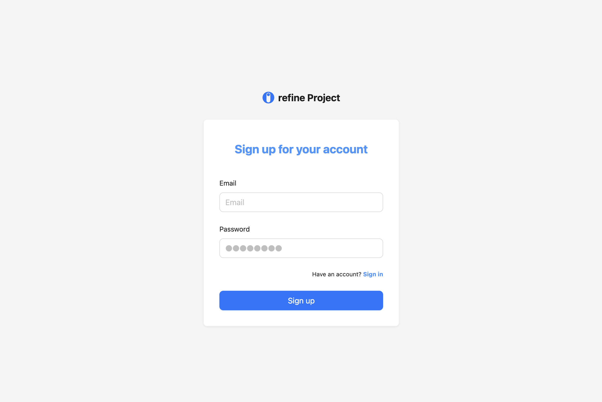
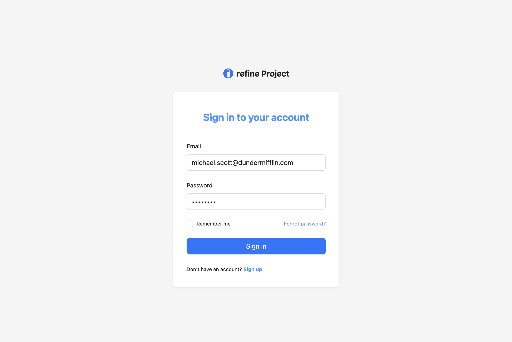
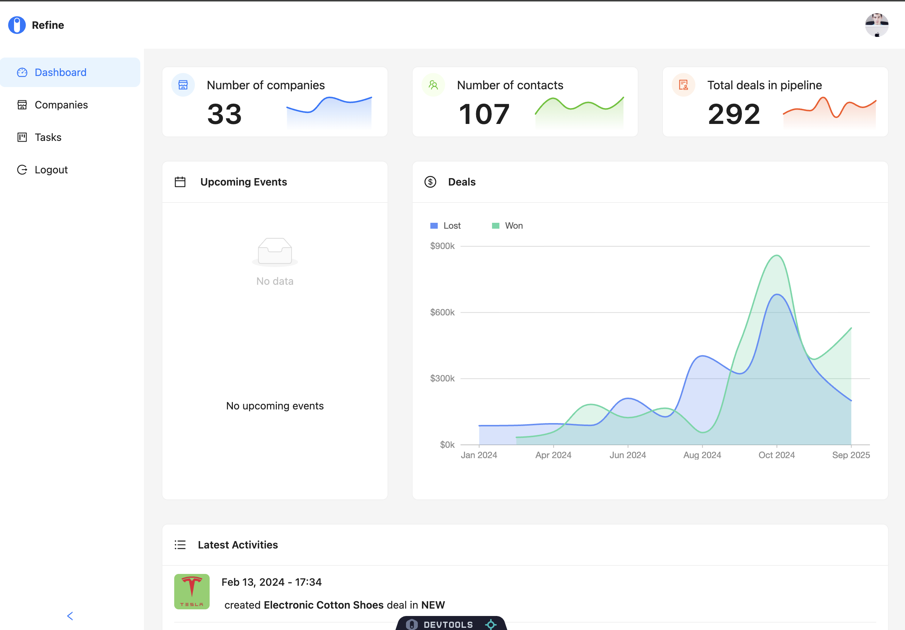
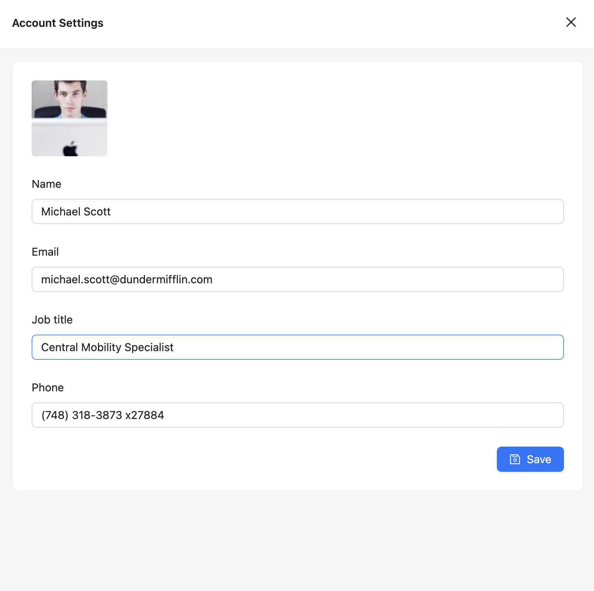

# React CRM Dashboard

## Introduction

React-based CRM dashboard featuring comprehensive authentication, antd charts, sales management, and a fully operational kanban board with live updates for real-time actions across all devices.

---

## Tech Stack

- **React.js**
- **TypeScript**
- **GraphQL**
- **Ant Design**
- **Refine**
- **Codegen**
- **Vite**

---

## Features

### 🔐 Authentication

- Seamless onboarding with secure login and signup.
- Robust password recovery ensures smooth authentication.

### 🛡️ Authorization

- Granular access control regulates user actions.
- Maintains data security and user permissions.

### 🏠 Home Page

- Dynamic dashboard with interactive charts for key metrics.
- Real-time updates on activities, upcoming events, and deals.

### 🏢 Companies Page

- Full CRUD for company management and sales processes.
- Detailed profiles with add/edit functions, associated contacts/leads, pagination, and field-specific search.

### 📋 Kanban Board

- Collaborative board with real-time task updates.
- Customization: due dates, markdown descriptions, multi-assignees.
- Tasks dynamically shift across dashboards.

### ⚙️ Account Settings

- Personalized user account settings for profile management.
- Streamlined configuration for tailored experience.

### 📱 Responsive Design

- Full responsiveness across devices.
- Fluid design adapts seamlessly to various screen sizes.

---
